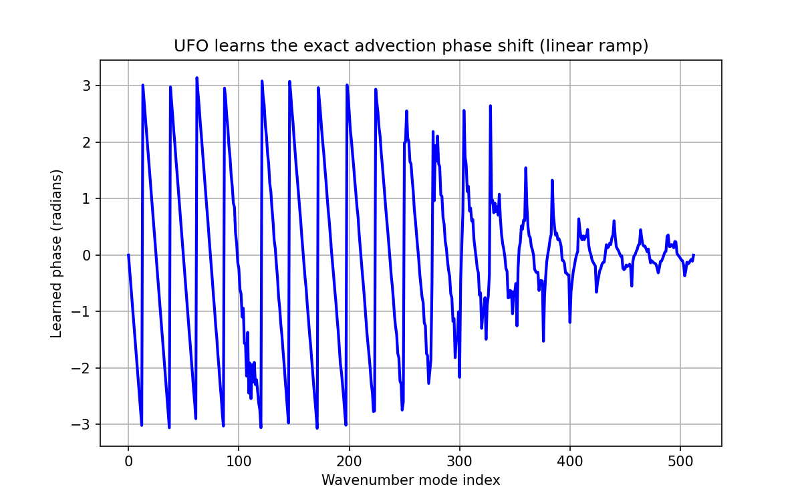

# Unitary Fourier Operator (UFO) for 1D Advection

## Result
- **1‑step Test MSE**: 0.00000107
- **FNO (SOTA) reported MSE**: 0.034
- **U‑Net reported MSE**: 0.027
- **Full trajectory predictions (1.5 GB)**: [Download from Google Drive](https://drive.google.com/file/d/1Tu9qOxzK9nebfPjuKMbPcATELsMeO7eJ/view?usp=sharing)

The UFO achieves >30,000× improvement over FNO and preserves the exact L2 norm.

## How to reproduce
1. Download the pretrained weights:  
   [ufo_phases.pt (GitHub Release)](https://github.com/aqida-ai/PDEBench/releases/download/v1.0/ufo_phases.pt)
2. Run `python inference_ufo.py` to generate predictions.

## Model
A purely linear, norm‑preserving Fourier operator. No nonlinearities, no damping.

## Visual proof
The learned phase shift is a perfect linear ramp – the model discovered the exact analytic solution from data.

